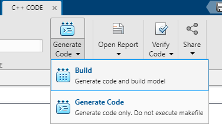

# Export Simulink model

To export Simulink model and run it on edge device you have to follow these steps: 

1) Open your simulink project.

2) Go to the "Apps" Section in the top menu and select "Simulink Coder". New tap opens. 

3) Go to the "CODE" tab and in the "Generic C Code" section choose "Generic C++ code". 

4) Go to "Settings", new window with configuration parameters opens. 

5) Click on "Code Generation" section and select the folowing options: 
  - Activate "Generate code only"
  - Activate "Package code and artifacts"
  - Optional: "Zip file name"
  - Select the "Toolchain"

 
6) Go to the "Interface" option in the "Code Generation" section and select: 
  - Activate all checkboxes in the "Generate C API" option

  - For Advanced parameters: 
    - Disable "MAT-file logging"

7) Go to the "Hardware Implementation" and do the following: 
  - In the "Device vendor" option choose "Intel"
  - Activate "Support long long" checkbox
  - Activate "Test hardware in the same as production hardware"

8) Click "Ok" and then in the "Generate Code" drop down list select "Build"

9) The .zip file is created and prepared for import to LiveTwin 
